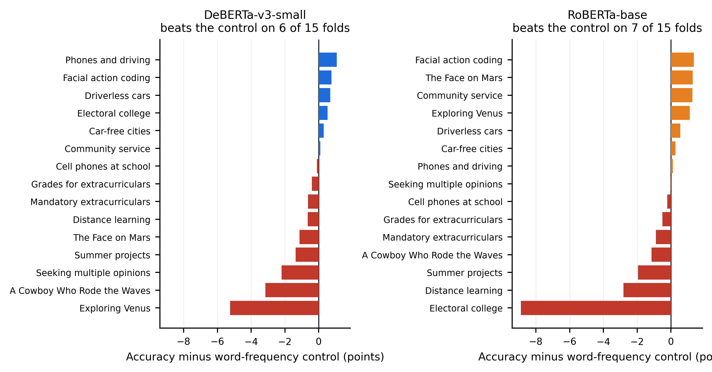
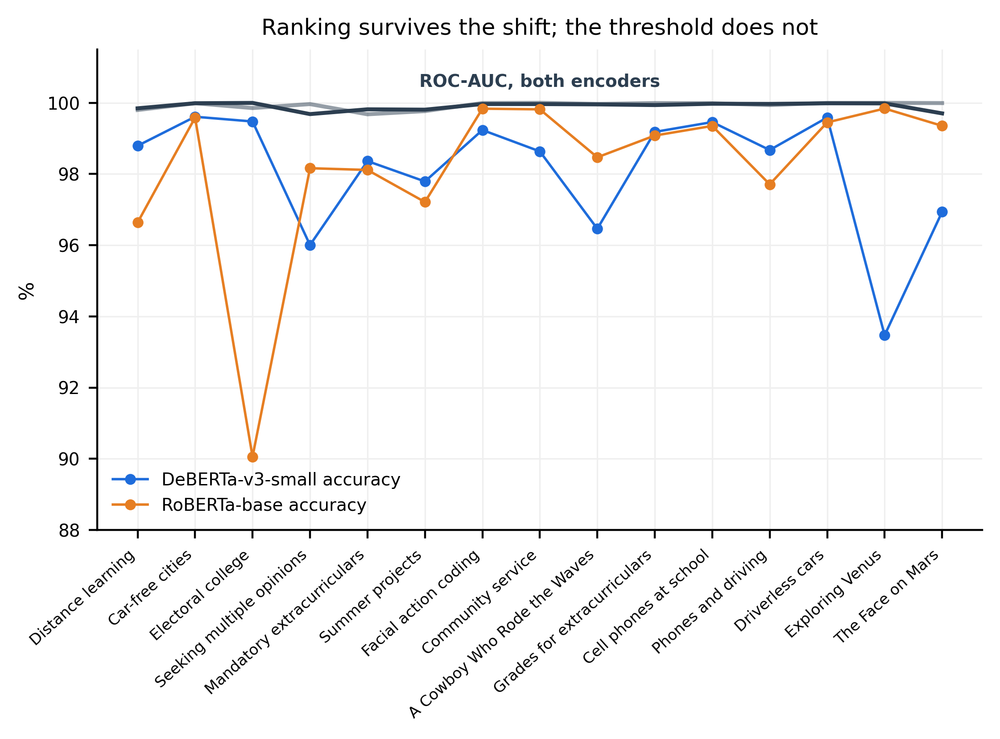
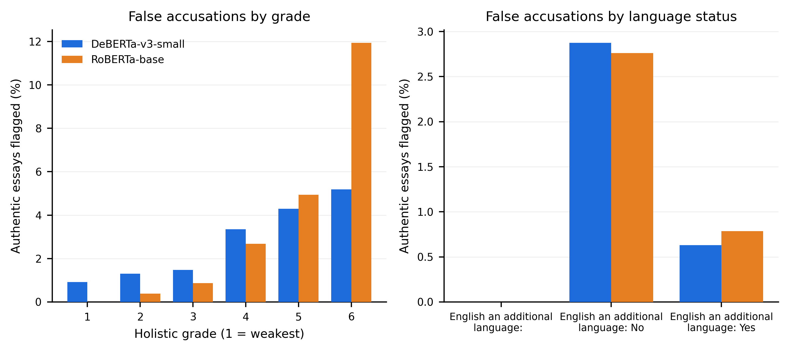
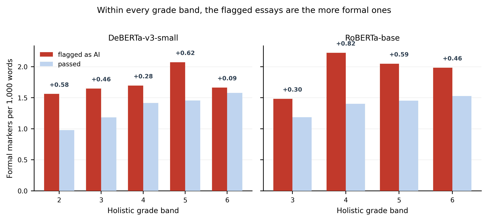

# GRADE: Generalization Robustness Assessment for Detectors in Education

Code and results for a leave-one-assignment-out (LOTO) evaluation of
AI-text detectors on student essays, and an attribution of every false
accusation to the writer who produced the essay.

The study asks two questions:

- **RQ1.** If a detector is trained on a set of assignments and then meets
  an assignment absent from training, how much of its reported performance
  survives?
- **RQ2.** When it is wrong about authentic student work, which students
  absorb the error?

## Headline results

| | |
|---|---|
| Accuracy on an unseen assignment | 93.47–99.84% across 15 folds, both encoders |
| Word-frequency control | matches or beats DeBERTa on 9/15 folds, RoBERTa on 8/15 |
| ROC-AUC | never below 99.68% on any fold |
| False-positive rate, grade 1 → grade 6 | 0.92% → 5.18% (5.6×) |

Accuracy on a genuinely unseen assignment stays high, but a classifier
built only from word frequencies matches or beats a fine-tuned transformer
on a majority of folds, so that accuracy is not by itself evidence of
detecting authorship. ROC-AUC stays above 99.68% everywhere, which locates
the loss in the decision threshold rather than the representation. The
false positives that remain fall disproportionately on the most highly
graded writers, and a within-grade-band test ties this to formal writing
style rather than to grade itself.

**RQ1 — the detector against a control that cannot recognise authorship.**
Every bar left of zero is an assignment where word frequency alone matched
or beat the fine-tuned detector.



**Where the accuracy goes.** Ranking survives the shift and the decision
threshold does not: ROC-AUC holds above 99.68% on every fold while accuracy
falls as low as 93.47% (DeBERTa) and 90.06% (RoBERTa).



**RQ2 — who absorbs the error.** False accusations on authentic work, by
holistic grade and by English-language status, for both encoders.



**Why.** Within every grade band, the authentic work the detector flagged
carries a denser use of formal discourse markers than the work it passed,
so formality predicts a flag beyond what grade accounts for.



## Protocol

One assignment is held out at a time. The detector is fine-tuned on the
remaining 14 under one fixed recipe and scored only on the assignment
withheld, rotating over all 15. Three split properties are enforced by
audits that raise and halt the study rather than warn:

1. no essay from the held-out assignment appears in training or validation;
2. no text appears in more than one portion of the split;
3. every portion carries equal numbers of student and generated essays.

Two controls that cannot recognise authorship — length-only and
word-frequency — are refitted on every fold's training portion, so each
detector result is reported against a comparison that met the same
held-out assignment under the same conditions.

## Repository layout

```
notebooks/    GRADE_full_study_v2      the DeBERTa sweep, all 15 folds
              GRADE_roberta_full       the RoBERTa sweep, all 15 folds
              GRADE_roberta_extremes   RoBERTa on the two extreme folds
              GRADE_figures            every chart, both encoders
scripts/      corpus construction, split audits, figure scripts
results/      per-run metrics, per-sample predictions, figures
datasets/     download instructions only (see datasets/README.md)
```

## Data

Corpora and model checkpoints are **not** committed: both are regenerable
and some exceed GitHub's file limit. `datasets/README.md` gives the
download instructions. `results/loto_predictions/` contains per-sample
predictions keyed by a hash of the essay text, so predictions are
reproducible without redistributing student writing.

## Reproducing

Training runs on a single GPU. The configuration is fixed across both
encoders and all 15 folds: AdamW, learning rate 2e-5, batch size 8,
5 epochs, max 256 tokens, seed 42 — 15 folds × 2 encoders = 30 runs.

## Status

Research in progress. Results in `results/` are seed 42 only; a multi-seed
sweep is not yet run.
